# 🛒 E-commerce Sales Analysis

## 🎯 Project Objective
The goal of this project is to architect a **Strategic Decision-making Framework** for a UK-based online retailer. Moving beyond simple data cleaning, this analysis integrates temporal, geographic, and behavioral analytics to identify high-velocity operational windows and segment the customer base into actionable tiers to maximize $ROI$ and enhance **Revenue Recovery**.

**Data Scope:** Dec 2010 – Dec 2011 • **Cleaned Records:** 397K+ Transactions • **Market Reach:** 38 Countries

---

## 🚀 Strategic Insights (Key Findings)
- **The Golden Window**: Identified a high-velocity sales window during **Mid-week (Tue-Thu)** and **Mid-day (10:00 - 15:00)**, providing a data-backed roadmap for precisely timed marketing campaigns.
- **Pareto Concentration**: Validated that **20.94% of SKUs generate 78.93% of total revenue**, justifying a "Hero-first" inventory and promotion strategy.
- **Geographic Risk**: 82% of revenue is centralized in the UK, highlighting a significant geographic dependency and the urgent need for expansion into emerging European markets.
- **RFM Personas**: Segmented customers into 3 actionable tiers:
    - **Champions (30.2%)**: High-value loyalists for retention.
    - **At-Risk (31.3%)**: Former spenders requiring immediate **Win-back** efforts.
    - **Hibernating (38.5%)**: Low-engagement tiers for automated re-activation.

---

## 📊 Full Analytical Workflow (11-Step Audit)
This project follows a standardized 3-phase analytical framework. All visuals are auto-exported via a custom Python pipeline for reproducibility.

### **Phase 1: Operational Diagnostic Audit**
*Focus: Identifying 'When' and 'Where' revenue velocity is highest.*

| 01. Monthly Trends | 02. Revenue by Day | 03. Revenue by Hour |
| :---: | :---: | :---: |
| 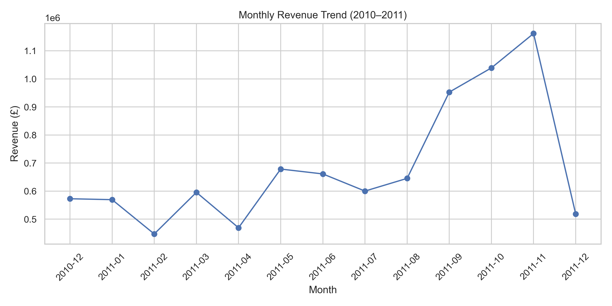 | 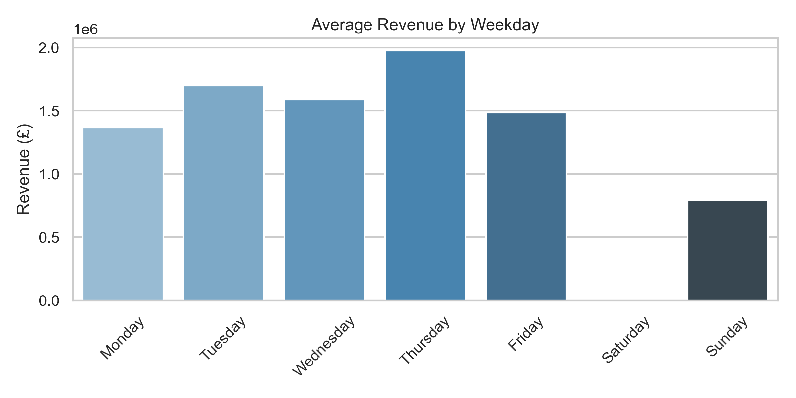 | 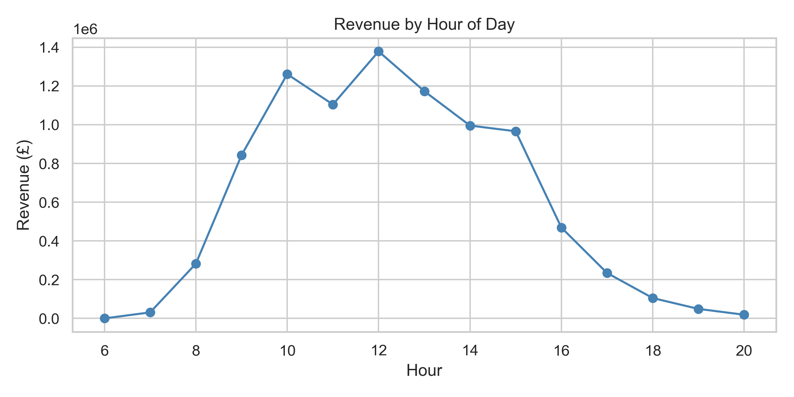 |
| **04. Top 15 Products** | **06. Top 10 Countries** | |
| 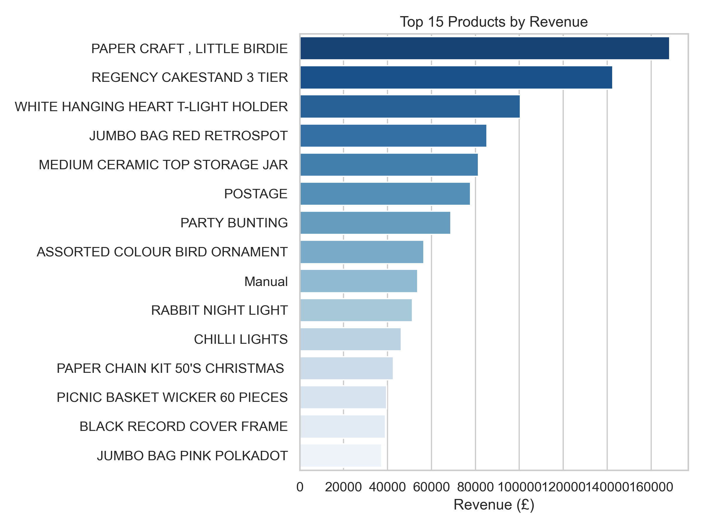 | 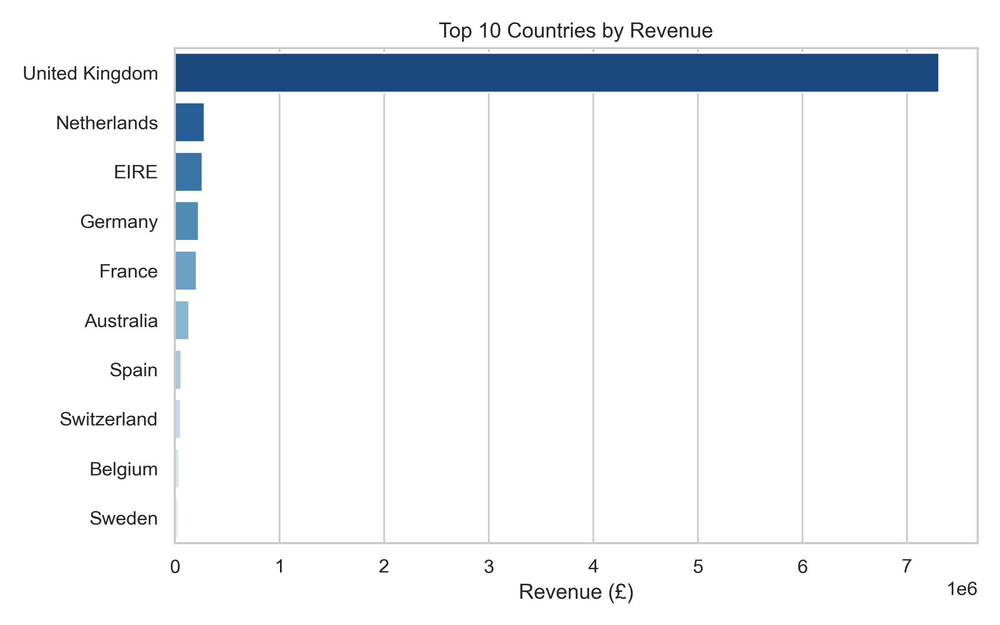 | |

### **Phase 2: Portfolio & Market Resilience**
*Focus: Quantifying business risk through concentration analysis.*

| 05. Product Pareto Curve | 07. Geographic Concentration |
| :---: | :---: |
| 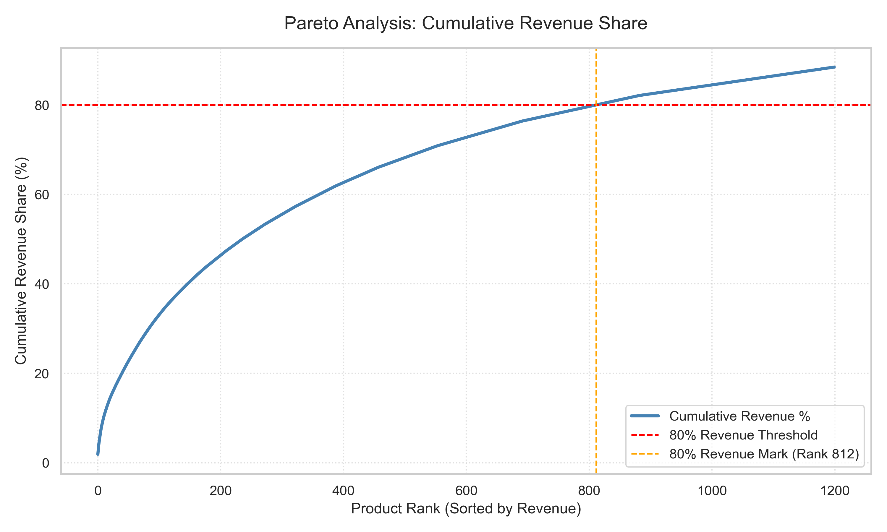 | 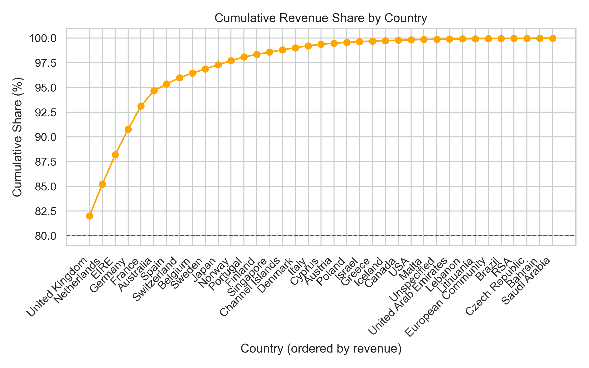 |

### **Phase 3: Behavioral Intelligence & ML Clustering**
*Focus: Data preprocessing and K-Means segmentation for persona building.*

| 08. RFM Raw Distribution | 09. Log Transformation | 10. K-Means Elbow Method |
| :---: | :---: | :---: |
| 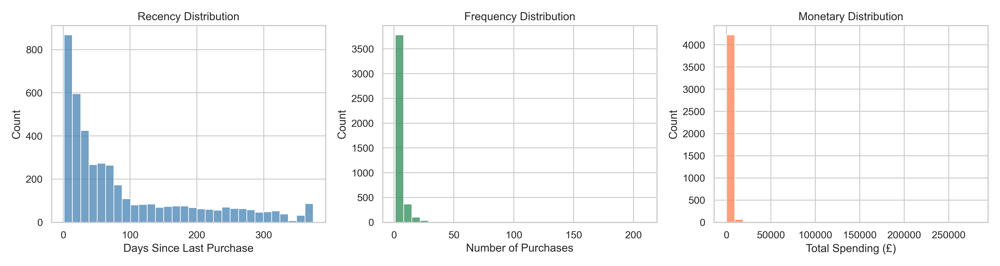 | 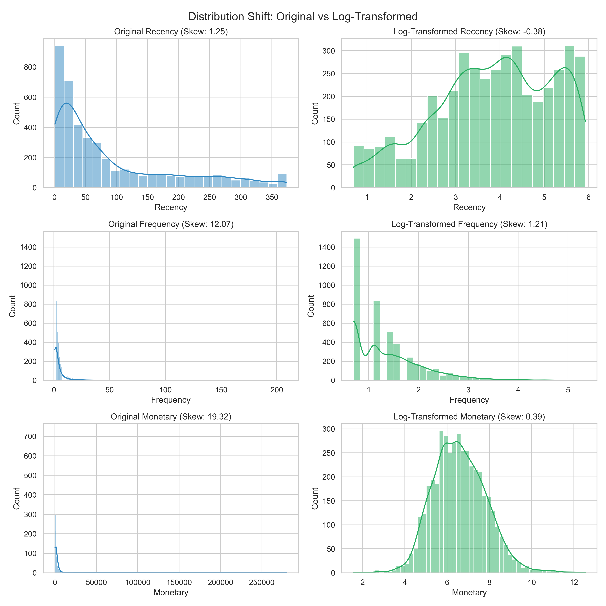 | 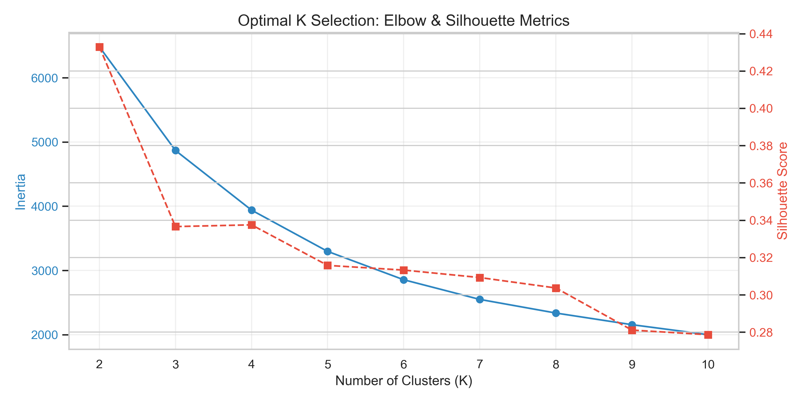 |
| **11. 3D RFM Clusters** | | |
| 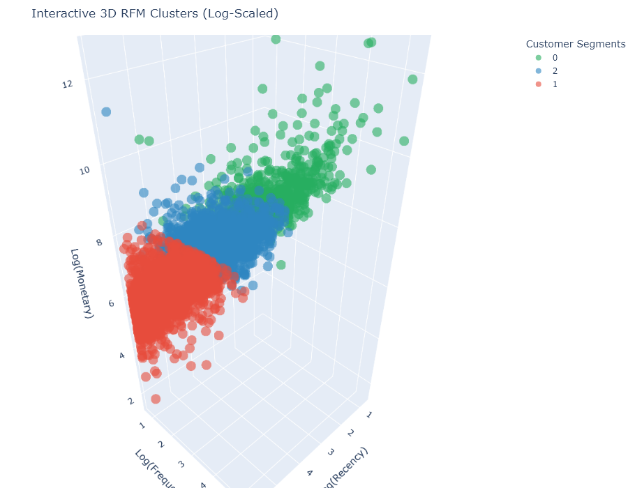 | | |

---

## 📊 Power BI Executive Dashboard
A high-fidelity **Power BI Dashboard** complements the Python analysis, providing stakeholders with interactive access to the Star Schema-modeled data.
* **Files**: `powerbi/ecommerce_dashboard.pbix` (Interactive), `ecommerce_dashboard.pdf` (Static Preview)
* **Model**: Optimized for performance using a **Star Schema** (Fact_Sales, Dim_Customer, Dim_Product).

---

## 🧰 Tech Stack & Methodology
* **Analytics**: Python (Pandas, Numpy), RFM Logic, Pareto Principle.
* **Machine Learning**: Scikit-learn (K-Means Clustering, StandardScaler), Log Transformation for skewness mitigation.
* **Visualization**: Seaborn, Matplotlib, **Plotly** (3D Interactivity), **Kaleido** (Static Export).

---

## 🚀 How to Run
1. **Clone the Repo**:
   ```bash
   git clone [https://github.com/Hyeri-Jerrie-Kim/ecommerce-sales-analysis.git](https://github.com/Hyeri-Jerrie-Kim/ecommerce-sales-analysis.git)
2. **Install Dependencies**:
   ```bash
   pip install -r requirements.txt
   ```
3. Run Analysis:
   Execute `notebooks/ecommerce_analysis.ipynb` to regenerate all insights and 11 visual assets.

## 🔗 Author & Links

Hyeri Kim — 🌐 [LinkedIn](https://linkedin.com/in/hyerikim-ds) | 📧 [Hyeri Kim](mailto:hyeri5524@gmail.com) 


