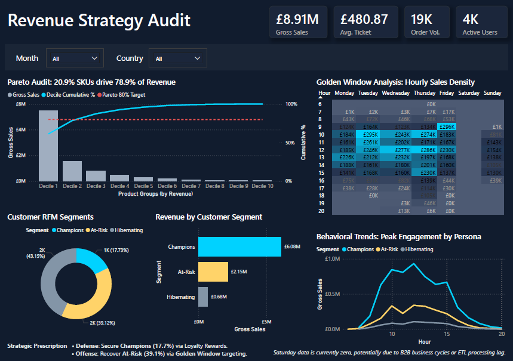

# 🛒 E-Commerce Revenue Strategy Audit
**Operational Audit & Behavioral Segmentation for Strategic Growth**

## Strategic Objective
The primary objective of this project is to architect a **Strategic Decision-making Framework** for a UK-based online retailer. By integrating temporal, geographic, and behavioral analytics, the study identifies high-velocity operational windows and segments the customer base into actionable tiers to maximize $ROI$ and enhance **Revenue Recovery**.

* **Raw Ingestion Scope**: Dec 2010 – Dec 2011 • 541,909 Ledger Records • 38 Countries
* **Certified Gold Layer**: 397,884 Verified Transactions (144,025 Unreconciled Records Remediated)

---

## Enterprise Data Governance & Quality Framework (Upstream Gate)
Prior to analytics consumption, raw transactional logs (`data/raw/ecommerce_data.csv`) undergo a rigorous Data Quality (DQ) verification gate aligned with **OSFI E-13** operational risk and **BCBS 239** data integrity standards.

### 1. Enterprise Business Glossary & CDE Catalog
* **Framework Artifact**: [`governance/Enterprise_Business_Glossary_Framework.xlsx`](governance/Enterprise_Business_Glossary_Framework.xlsx)
* Standardized 8-column metadata schema structured across a 4-layer logical governance flow (Concept → Ownership → Classification → Technical Enforcement).

| Term Name | Business Definition | Business Owner | Data Steward | Critical Data Element (CDE) | PII Classification | Physical Asset Mapping | DQ Validation Rule |
| :--- | :--- | :--- | :--- | :---: | :--- | :--- | :--- |
| **Customer ID** | Unique alphanumeric identifier assigned to an authenticated retail account across checkout channels. | VP, Retail Operations | Customer Operations Steward | `Yes` | Confidential / PII | `tbl_customer_master.customer_id` | 100% Non-Null; Validated against Customer Master |
| **Invoice Number** | Unique 6-digit transaction ledger code; prefixed with 'C' for order cancellations and adjustments. | VP, Finance & Billing | Financial Ledger Steward | `Yes` | Internal | `tbl_transaction_ledger.invoice_no` | 6-digit format; Cancellations strictly prefixed with 'C' |
| **Stock Code** | Standardized inventory SKU alphanumeric identifier representing physical trade merchandise. | Director, Supply Chain | Inventory Data Steward | `Yes` | Public | `tbl_transaction_ledger.stock_code` | Alphanumeric SKU standard; Non-null constraint |
| **Unit Price** | Agreed selling price per unit in GBP (£) excluding applicable surcharges and sales tax. | VP, Commercial Strategy | Commercial Pricing Steward | `Yes` | Public | `tbl_transaction_ledger.unit_price` | Floating point strictly > 0.00 |
| **Transaction Quantity** | Net physical unit volume purchased or returned within an individual ledger line item. | VP, Fulfillment Operations | Fulfillment Operations Steward | `Yes` | Public | `tbl_transaction_ledger.quantity` | Integer != 0; Negative values strictly paired with 'C' Invoices |
| **Line Revenue** | Derived gross financial line value calculated at point-of-sale ($Quantity \times UnitPrice$). | VP, FP&A | Revenue Analytics Steward | `No` | Internal | `tbl_financial_fact.line_revenue` | Reconciles with Quantity * Unit Price |

### 2. Automated SQL Data Quality Suite & SLA Monitoring
* **SQL Engine**: [`sql/data_quality_suite.sql`](sql/data_quality_suite.sql) (ANSI SQL / CTE-based Aggregation Engine)
* **Automated Runner**: [`sql/execute_dq_suite.py`](sql/execute_dq_suite.py) (In-Memory Database Ingestion & Audit Pipeline)
* **Audit Summary Output**: [`governance/dq_audit_summary_report.csv`](governance/dq_audit_summary_report.csv)

#### Executive DQ Audit Summary Report (541,909 Records Audited)

| DQ Dimension | Target Rule & Metric | SLA Threshold | Total Records | Failure Count | Failure Rate (%) | SLA Status |
| :--- | :--- | :--- | :--- | :--- | :--- | :--- |
| **Completeness** | Customer ID Non-Null | 100% Populated (0% Null SLA) | 541,909 | 135,080 | 24.93% | `BREACH` |
| **Uniqueness** | Composite PK (`invoice_no` + `stock_code`) | 100% Distinct Constraints | 541,909 | 9,694 | 1.79% | `BREACH` |
| **Validity** | Unit Price Strictly Positive | Unit Price > 0.00 | 541,909 | 2,517 | 0.46% | `BREACH` |
| **Validity** | Cancellation Reversal Pairing | Negative Qty strictly with 'C' Prefix | 541,909 | 1,336 | 0.25% | `BREACH` |
| **Validity** | Quantity Non-Zero | Quantity != 0 | 541,909 | 0 | 0.00% | `PASS` |
| **Consistency** | Line Revenue Ledger Reconciliation | Line Revenue = Quantity * UnitPrice | 541,909 | 0 | 0.00% | `PASS` |

### 3. Production Remediation & Incident Escalation Protocol
In adherence to internal controls and separation of duties between Stewards and IT Custodians, analysts never arbitrarily modify source records. When automated DQ metrics breach predefined SLAs, formal defect remediation protocols are triggered:
* **Remediation SLA Window**: 24 Business Hours Turnaround
* **Formal Notice**: [`governance/dq_incident_escalation_notice.md`](governance/dq_incident_escalation_notice.md)
* **Downstream Promotion**: Only certified, remediated datasets (397,884 rows) are promoted to the curated reporting layer (`powerbi/` and `notebooks/`).

## Strategic Insights (Key Findings)
- **The Golden Window**: Identified a high-velocity sales window during **Mid-week (Tue-Thu)** and **Mid-day (10:00 - 15:00)**, providing a data-backed roadmap for precisely timed marketing campaigns.
- **Pareto Concentration**: Validated that **20.94% of SKUs generate 78.93% of total revenue**, justifying a "Hero-first" inventory and promotion strategy.
- **Geographic Risk**: 82% of revenue is centralized in the UK, highlighting a significant geographic dependency and the urgent need for expansion into emerging European markets.
- **RFM Personas**: Segmented customers into 3 actionable tiers:
    - **Champions (17.7%)**: High-value loyalists for retention.
    - **At-Risk (39.1%)**: Former spenders requiring immediate **Win-back** efforts.
    - **Hibernating (43.2%)**: Low-engagement tiers for automated re-activation.

---

## Integrated Analytical Framework (The 8-Step Flow)
This project transforms raw transactional data into prescriptive strategies through a structured methodology.

### **Phase 1: Operational Diagnostic Audit**
1. **Temporal Trend Analysis**: Identified peak revenue cycles across monthly and seasonal dimensions.
2. **The "Golden Window" Identification**: Pinpointed maximum sales velocity during **Mid-week** and **Mid-day**.
3. **Geographic Performance Evaluation**: Assessed market dominance (UK) and international expansion potential.
4. **Regional Concentration Analysis**: Quantified geographic revenue dependency to evaluate market risks.

### **Phase 2: Portfolio Resilience & Concentration**
5. **Product Velocity Analysis**: Classified top-performing products as core revenue drivers.
6. **Revenue Concentration (Pareto Principle)**: Confirmed that the top **20.94%** of products generate **78.93%** of revenue.

### **Phase 3: Behavioral Segmentation & Prescription**
7. **Customer Behavioral Clustering**: Applied **K-Means Clustering** ($K=3$ ) on log-normalized **RFM** metrics.
8. **Strategic Prescriptive Analytics**: Synthesized insights into targeted marketing roadmaps for VIP retention and churn recovery.

---

## Visual Analysis Audit (11 Strategic Assets)
The above 8-step framework is visualized through **11 key assets**, auto-exported via a Python pipeline.

### **Phase 1: Operational Diagnostic Audit**
*Focus: Identifying 'When' and 'Where' revenue velocity is highest.*

| 01. Monthly Trends | 02. Revenue by Day | 03. Revenue by Hour |
| :---: | :---: | :---: |
|  |  |  |
| **04. Top 15 Products** | **06. Top 10 Countries** | |
|  |  | |

### **Phase 2: Portfolio & Market Resilience**
*Focus: Quantifying business risk through concentration analysis.*

| 05. Product Pareto Curve | 07. Geographic Concentration |
| :---: | :---: |
|  |  |

### **Phase 3: Behavioral Intelligence & ML Clustering**
*Focus: Data preprocessing and K-Means segmentation for persona building.*

| 08. RFM Raw Distribution | 09. Log Transformation |
| :---: | :---: |
|  |  |
| **10. K-Means Elbow Method** | **11. 3D RFM Clusters** |
|  |  |

---

## Operational Audit Dashboard

_Designed to bridge the gap between high-level KPIs and daily operational execution._

<p align="center">
  <a href="powerbi/Revenue_Strategy_Audit_v1.0.png">
    
  </a>
  <br>
  <em>Click for high-resolution PNG view</em>
</p>

<p align="center">
  <a href="powerbi/Revenue_Strategy_Audit_v1.0.pbix">
    
  </a>
  <a href="powerbi/Revenue_Strategy_Audit_v1.0.pdf">
    
  </a>
</p>

#### **Key Functional Modules:**
- **Strategic Market Audit**: Visualized the **82% UK dependency** and identified the **Netherlands** as a high-value B2B hub **(AOV: £3,036)** versus scalable B2C growth corridors in **Germany/France**.
- **Precision Churn Monitor**: Leveraged a data-backed **44-day recency threshold** to categorize the **39.1% At-Risk segment**, enabling targeted win-back automation.    
- **Revenue Velocity Tracker**: Highlighted the **"Golden Window" (Tue-Thu, 10-15h)** to align marketing efforts with peak organic engagement.

#### **Strategic Prescriptions (Actionable Insights)**
The dashboard transcends simple reporting by providing a "Next Steps" framework for stakeholders:
* **Retention Strategy**: Deploy personalized win-back offers for the **At-Risk** segment specifically within the **44-day window** to prevent permanent churn.
* **Market Expansion**: Allocate **15% of the marketing budget** to high-AOV European B2B clusters to diversify geographic risk.
* **Operational Efficiency**: Schedule weekly promotional pushes during the identified **Mid-week/Mid-day peak** to maximize organic engagement and ROI.

---

## Tech Stack & Methodology
- **Analytics**: RFM Analysis, Pareto/Concentration, Time-series Decomposition.
- **Machine Learning**: Scikit-learn (K-Means Clustering, StandardScaler, Elbow Metrics).
- **Processing & Visualization**: Python (Pandas, Numpy), Plotly 3D, Seaborn, Power BI.

---

## How to Run
1. **Clone the Repo**:
   ```bash
   git clone [https://github.com/Hyeri-Jerrie-Kim/ecommerce-sales-analysis.git](https://github.com/Hyeri-Jerrie-Kim/ecommerce-sales-analysis.git)
2. **Install Dependencies**:
   ```bash
   pip install -r requirements.txt
   ```
3. Run Analysis:
   Execute `notebooks/ecommerce_analysis.ipynb` to regenerate all insights and 11 visual assets.

## 🔗 Author & Links

Hyeri Kim — 🌐 [LinkedIn](https://linkedin.com/in/hyerikim-ds) | 📧 [Hyeri Kim](mailto:hyeri5524@gmail.com) 


